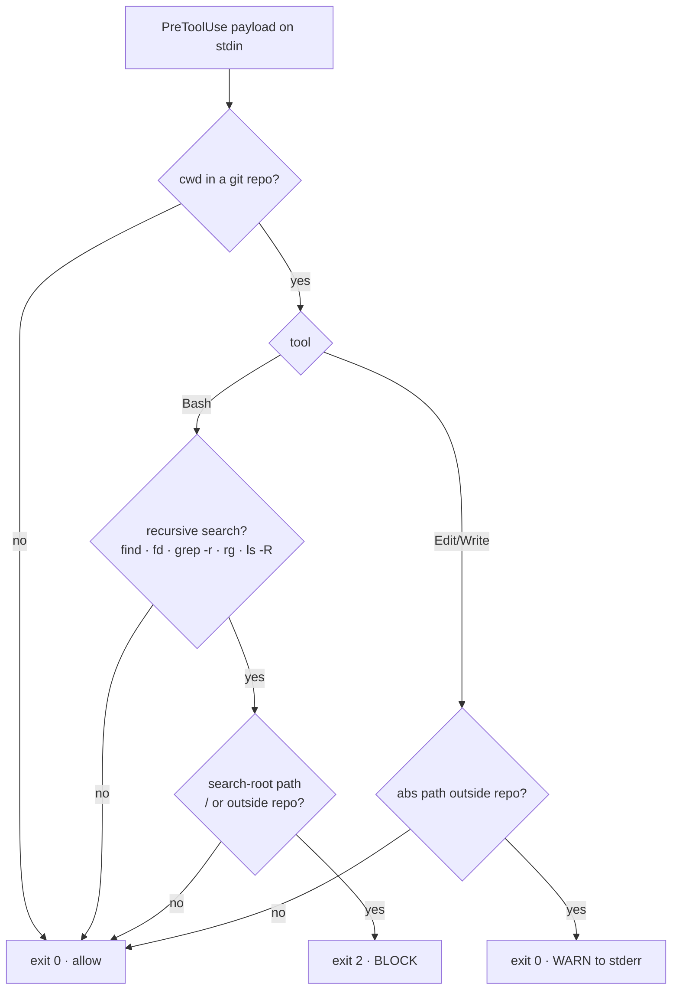

# wk-scope-guard

> A PreToolUse hook that blocks filesystem-root searches and out-of-repo recursive searches, and warns on Edit/Write outside the project root — the mechanical backstop for [wk-plan](../plan/README.md)'s simplest-viable scope gate.

**Version:** `2026.07.24-190504`

## Purpose

Skill text is advisory; under pressure it gets rationalized away. A hook fires
every time and cannot be argued with. This skill is the deterministic
guard against the most frequent scope-creep failure in the transcripts —
searching outside the project ("what are you looking for outside the scope of
the project?") and writing files outside the repo.

## Trigger

- **Auto** — `PreToolUse` hook (matchers `Bash` and
  `Edit|Write|MultiEdit|NotebookEdit`) fires before every matching tool call.
- **Manual** — `/wk-scope-guard --register` (print registration),
  `/wk-scope-guard --test` (run the bats suite).

## How It Works

## Key rules

- Blocks **only** recursive search commands, and **only** when a path argument
  is `/` or resolves outside the repo. Absolute paths inside the repo, relative
  paths, and non-search reads (`cat /etc/hosts`) are never blocked.
- Edit/Write outside the repo **warns, never blocks** — `$HOME/.claude` config
  writes are legitimate.
- `SCOPE_GUARD_OFF=1` bypasses the guard for the session — but it is **the user's to
  grant, never the agent's to self-authorize**. Retrying a blocked search with the var
  added is a bypass attempt; a denial of that retry is the correct outcome and must be
  treated as settled.
- **False blocks are reshaped, not bypassed.** Token inspection is lexical, so three
  shapes read as out-of-scope even when they are not: a recursive flag plus an
  unexpanded glob, a path glued to a trailing shell separator (`cd <root>;` tokenizes
  as `<root>;` — the hook now strips `;&|)` before comparing), and a search rooted in
  another repo's worktree (the root resolves from the session's CWD). Drop `-r`, drop
  the `cd`, or use `git grep -n "<term>"`; ask the user for scope if none fit.
- Allows everything when `cwd` is not a git repo (no repo root to reason about).

## Files

- Hook: `skills/scope-guard/hooks/scope-guard.sh` (installed to
  `$HOME/.agents/skills/wk-scope-guard/hooks/`)
  Registered in `$HOME/.claude/settings.json` → `hooks.PreToolUse` via
  `scripts/register-hooks.sh` (declared in `scripts/hooks-manifest.json`)
- Tests: `skills/scope-guard/tests/scope-guard.bats` (20 cases)

To wire this (and every other skill-shipped hook) into a fresh machine, run
`scripts/install-skills.sh` — it installs the skills and then calls
`register-hooks.sh` to merge the manifest into `settings.json` idempotently.

## Related

- [wk-plan](../plan/README.md) — the simplest-viable scope gate this hook enforces.
- [wk-env](../env/README.md) — the other PreToolUse hook skill; same ship-script-plus-registration pattern.
