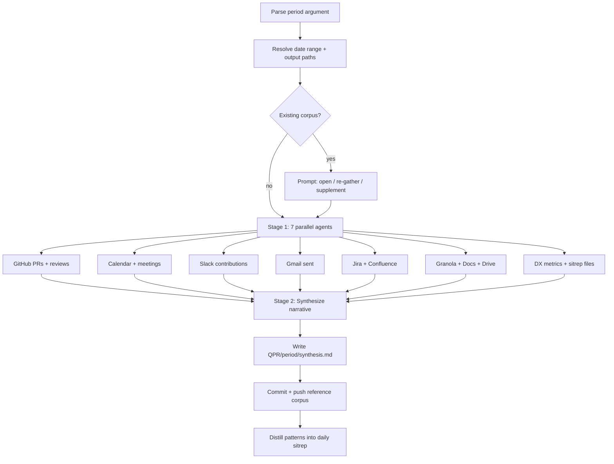

# wk-self-perf

> Generate a self-performance review narrative by pulling data from all work systems.

**Version:** `2026.07.28-171103`

## Invocation

| Mode | Trigger |
|------|---------|
| User-invocable | `/wk-self-perf <period>` — e.g. `quarter`, `Q1`, `week`, `annual` |
| Model-invocable | not auto-invoked |

## How It Works

## Noteworthy

- Uses **7 parallel subagents** to fetch evidence simultaneously — each writes to
  `QPR/<period>/references/<source>.md` before synthesis begins.
- Period arguments map to **$EMPLOYER FY quarters** (Feb–Jan default): Q1 = Feb–Apr, Q2 = May–Jul, etc.
  Custom ranges accepted as `YYYY-MM-DD:YYYY-MM-DD`.
- Synthesis uses a strict **impact-language guide** — "worked on" → "designed and shipped";
  surface-level language is automatically upgraded to strong-verb form.
- **`{ROLE}` placeholder** in the synthesis template must be resolved from Workday/Lattice
  before writing; if unresolvable, left as placeholder with a flag.
- Supplement mode (default in auto) is additive — only missing or stale reference files are
  re-gathered, not the entire corpus.
- The **QPR/brag-log.md** accumulates highlights across quarters so each new QPR starts with
  a richer corpus from prior periods.
