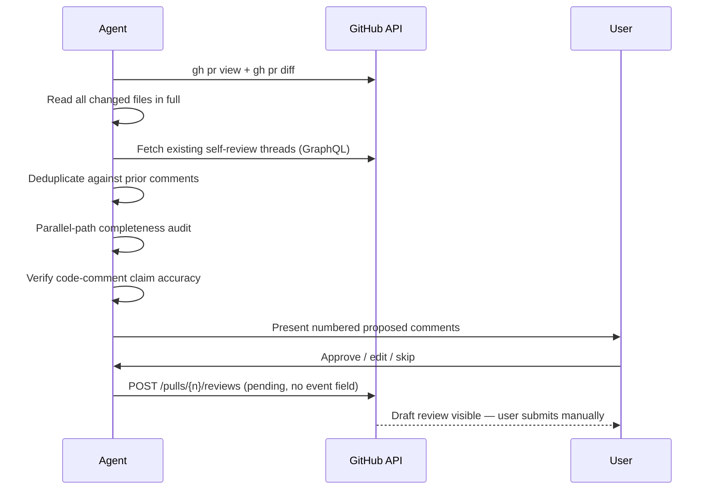

# wk-self-review

> Post inline self-review comments on your own PR to document design decisions for human reviewers.

**Version:** `2026.07.28-001124`

## Invocation

| Mode | Trigger |
|------|---------|
| User-invocable | `/wk-self-review` or "self-review this PR" |
| Model-invocable | automatic: invoked by [`wk-pr`](../pr/README.md) after CI passes |

## How It Works

## Noteworthy

- **HARD RULE: always a pending review** — comments go through `/pulls/{n}/reviews` with the
  `event` field omitted. Never use the raw `/comments` endpoint, which publishes immediately
  and bypasses the human-in-the-loop checkpoint.
- `"event": "PENDING"` is **not** a valid enum value and returns HTTP 422 — omit the field
  entirely to create a pending (draft) review.
- **Step 2.5 deduplication** is mandatory on multi-round PRs — prior self-review threads are
  fetched and checked for topical overlap before proposing new comments to avoid restating
  rationale that's already on the PR.
- **Step 2.6 parallel-path audit** checks sibling files and sibling code paths for the same
  fix class (credential redaction, input validation, error handling) — a bug class rarely
  exists in a single location.
- **Step 2.7 comment-accuracy check** verifies that inline code comments make claims that are
  still true after the PR's changes; stale comments are fixed in-branch, not noted as review
  comments.
- Signal over noise: design decisions, security-sensitive paths, and behavioral gotchas merit
  comments; formatting fixes and obvious renames do not.
- **Architecture changes escalate to [`wk-arch-review`](../arch-review/README.md):** Step 2 detects
  diffs that introduce/alter architecture (design docs, new services/datastores/IaC, trust-boundary
  or API/contract changes, ownership-reshaping migrations), runs the review, and seeds self-review
  context — a rationale note plus inline comments on the flagged SPOFs and risky assumptions.
