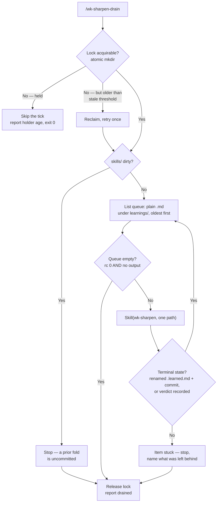

# wk-sharpen-drain

> Drains the undistilled-learning queue through [wk-sharpen](../sharpen/README.md) one fold at a time — owns the queue order, the single-run-in-flight lock, and the per-item completion check.

**Version:** `2026.07.28-154518`

## Invocation

| Mode | Trigger |
|------|---------|
| User-invocable | `/wk-sharpen-drain [--max=N] [--status] [--release]` |
| Model-invocable | Disabled by design — an agent spawning its own folds is the failure this skill prevents |

## How It Works

## Noteworthy

- **One run in flight, machine-wide.** Concurrent folds contend over the same queue and the same `SKILL.md` files — two runs claim one learning, and one run's byte budget is voided by the other's edits landing mid-flight. An atomic `mkdir` lock outside the repo is the authority; `test -e` then create is a TOCTOU race.
- **A cadence tick skips, never stacks.** A schedule or `/loop` firing while a fold is live exits 0 and reports the holder's age. The lock decides whether work starts — not the interval.
- **The fold runs inline.** Nothing is backgrounded and no agent is spawned, so completion is observable; fire-and-forget dispatch per tick is what produced four simultaneous runs.
- **Stale locks are reclaimable.** A killed run would otherwise wedge the queue forever, so a lock older than `$WK_DRAIN_STALE_MINUTES` (default 90) is reclaimed once; a younger one is always waited out. `--release` handles a run the user knows is dead.
- **Advancing requires a verified terminal state.** A rename to `.learned.md` without a commit is an unfinished run. Anything else is a stuck item that stops the loop by name — never a silent skip, which makes a broken fold look drained.
- **Dispatcher only.** Every `SKILL.md` edit, severity ordering within a run, and the `.learned.md` rename stay with [wk-sharpen](../sharpen/README.md); this skill decides only which learning is folded when. Queue items are written by [wk-learn](../learn/README.md).
