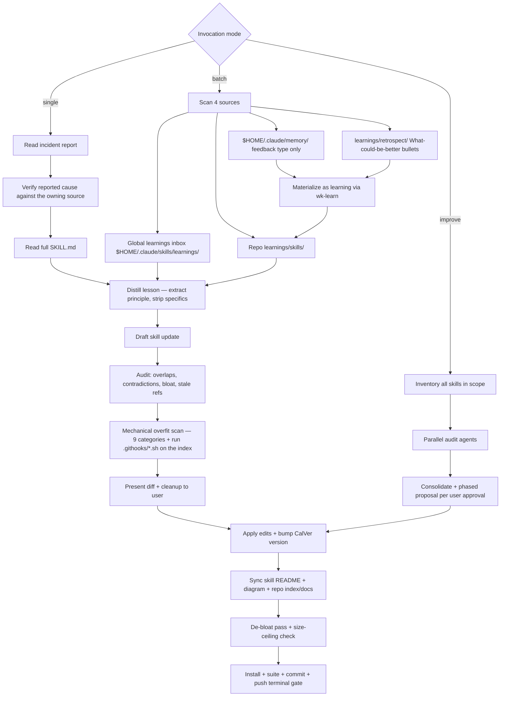

# wk-sharpen

> Distill field reports and prune skill bloat without overfitting on specific examples.

**Version:** `2026.07.24-235129`

## Invocation

| Mode | Trigger |
|------|---------|
| User-invocable | `/wk-sharpen <skill> [incident]`, `/wk-sharpen` (batch), `/wk-sharpen improve [scope]` |
| Model-invocable | automatic: after [`wk-retro`](../retro/README.md) surfaces skill gaps |

## How It Works

## Noteworthy

- **HARD RULE: [`wk-learn`](../learn/README.md) vs [`wk-sharpen`](../sharpen/README.md)** — [`wk-learn`](../learn/README.md) captures to `learnings/` only;
  [`wk-sharpen`](../sharpen/README.md) edits `SKILL.md`. Ambiguous phrasing ("learn from this") defaults to
  [`wk-learn`](../learn/README.md); only explicit "sharpen" or `/wk-sharpen` triggers SKILL.md edits.
- **The report is a hypothesis** — a learning's "Root cause" and "Suggested fix" are claims,
  not authority. When the subject is a deterministic artifact (hook, script, CI check), its
  source is read (and the failure reproduced where cheap) before drafting, and any fold that
  would *relax* a guard is rejected in favor of the underlying correctness bug. The run's own
  verification tooling is no more authoritative: a newly added case failing while every
  pre-existing case passes indicts the harness first, so the artifact is driven directly with
  the same input before the fold is touched.
- **A disproof voids the draft** — verification is not a pass/delete filter on the reported
  mechanism. Once reproduction disproves *or sharpens* it, the fold is re-derived from the
  source's semantics rather than reworded, since a corrected mechanism usually changes what the
  rule should say and upgrades a heuristic remediation to a deterministic one. The formulation a
  later run can drive the source to demonstrate wins.
- **Verifying a guard on the agent's own tool calls** — the faithful test input is itself a
  blocked call, so each payload is staged with the file-write tool and fed to the hook by
  redirect. The guard's opt-out is never used to run its own test.
- **Mechanical overfit scan** is mandatory before presenting any diff — 9 categories
  (reviewer logins, org prefixes, employer/internal project names, ticket IDs, repo names,
  line numbers, tool versions, person names, hardcoded branch names) are grepped against the
  proposed text.
- **Run the hooks, never reimplement their matcher** — a hook's pattern file carries `#`
  comments and PCRE inline flags that a hand-rolled `grep -iEf` turns into either false noise
  or a false-clean, so the scan executes `.githooks/*.sh` against the staged index. Only
  staged **path strings** are hand-rolled, because every content hook greps the diff and
  commit message but never filenames.
- **Terminal gate** (Step 8) requires all five checks: install prints `Done!`, the owning
  skill's test suite runs when the fold touched a shipped executable artifact, commits land,
  single push, and no modified tracked path — untracked *unprocessed* learnings/retros are
  expected state, not debris. Silence after edits is a violation.
- **Batch mode** mirrors the global learnings inbox (`$HOME/.claude/skills/learnings/`) into the
  repo tree before distilling, then drains the inbox by deleting originals after copy.
- **A re-scan arrival is not automatically this run's work.** An item whose mtime postdates
  the run's start is unowned, not assigned — peer sharpen agents share the tree and there is no
  lock, lease, or ownership marker to arbitrate a collision. Such items are reported as
  unclaimed backlog for the dispatcher, and the terminal state reads "processed N, M unclaimed
  arrivals" rather than "drained". A dispatcher's own claim that no peer is mid-fold is treated
  as a hypothesis that loses to contradicting evidence from the tree.
- **External memories become learnings first** — each `$HOME/.claude/memory/` feedback file is
  materialized as a version-controlled learning via [`wk-learn`](../learn/README.md) and distilled through the
  Source 2 path; the memory file itself is never renamed (only the materialized learning is).
- **Improve mode** requires explicit phased user approval even in auto mode — suite-scale
  refactoring is high blast-radius and can never be applied silently.
- **De-bloat pass** is mandatory on every run (not only when a learning prompts it) and
  enforces a hard 24 KiB ceiling per `SKILL.md` — over-ceiling skills are refactored, split into
  references/sub-skills, or scoped down, coverage-preserving. A pre-commit hook backstops the
  same ceiling. The byte budget for a near-ceiling fold is stated as explicit arithmetic —
  measured addition, each reclaim's measured net — before any edit is applied; estimating
  either side makes the mandated single pass a coin flip.
- The gitignored `.distilled-memories` marker prevents re-distilling the same global memory
  across runs (`--force` bypasses it); learnings **and retrospects** track their own processed
  state via the `.learned.md` rename — no marker. Retros are write-once per-session files, so
  the rename can never orphan later content (a new session writes a new file).
