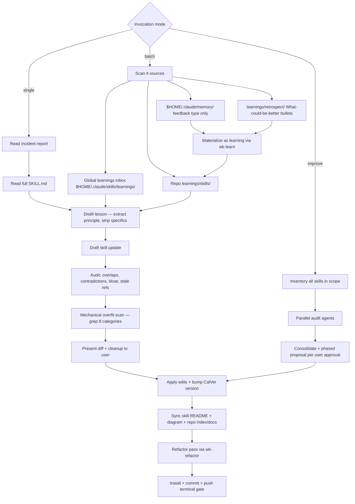

# wk-sharpen

> Distill field reports and prune skill bloat without overfitting on specific examples.

**Version:** `2026.06.29-233843`

## Invocation

| Mode | Trigger |
|------|---------|
| User-invocable | `/wk-sharpen <skill> [incident]`, `/wk-sharpen` (batch), `/wk-sharpen improve [scope]` |
| Model-invocable | automatic: after [`wk-retro`](../retro/README.md) surfaces skill gaps |

## How It Works

## Noteworthy

- **HARD RULE: [`wk-learn`](../learn/README.md) vs [`wk-sharpen`](../sharpen/README.md)** — [`wk-learn`](../learn/README.md) captures to `learnings/` only;
  [`wk-sharpen`](../sharpen/README.md) edits `SKILL.md`. Ambiguous phrasing ("learn from this") defaults to
  [`wk-learn`](../learn/README.md); only explicit "sharpen" or `/wk-sharpen` triggers SKILL.md edits.
- **Mechanical overfit scan** is mandatory before presenting any diff — 8 categories
  (reviewer logins, org prefixes, ticket IDs, repo names, line numbers, tool versions,
  person names, hardcoded branch names) are grepped against the proposed text.
- **Terminal gate** (Step 8) requires all four checks: install prints `Done!`, commits land,
  single push, clean tree — silence after edits is a violation.
- **Batch mode** mirrors the global learnings inbox (`$HOME/.claude/skills/learnings/`) into the
  repo tree before distilling, then drains the inbox by deleting originals after copy.
- **External memories become learnings first** — each `$HOME/.claude/memory/` feedback file is
  materialized as a version-controlled learning via [`wk-learn`](../learn/README.md) and distilled through the
  Source 2 path; the memory file itself is never renamed (only the materialized learning is).
- **Improve mode** requires explicit phased user approval even in auto mode — suite-scale
  refactoring is high blast-radius and can never be applied silently.
- **De-bloat pass** is mandatory on every run (not only when a learning prompts it) and
  enforces a hard 24 KiB ceiling per `SKILL.md` — over-ceiling skills are refactored, split into
  references/sub-skills, or scoped down, coverage-preserving. A pre-commit hook backstops the
  same ceiling.
- The gitignored `.distilled-memories` marker prevents re-distilling the same global memory
  across runs (`--force` bypasses it); learnings **and retrospects** track their own processed
  state via the `.learned.md` rename — no marker. Retros are write-once per-session files, so
  the rename can never orphan later content (a new session writes a new file).
