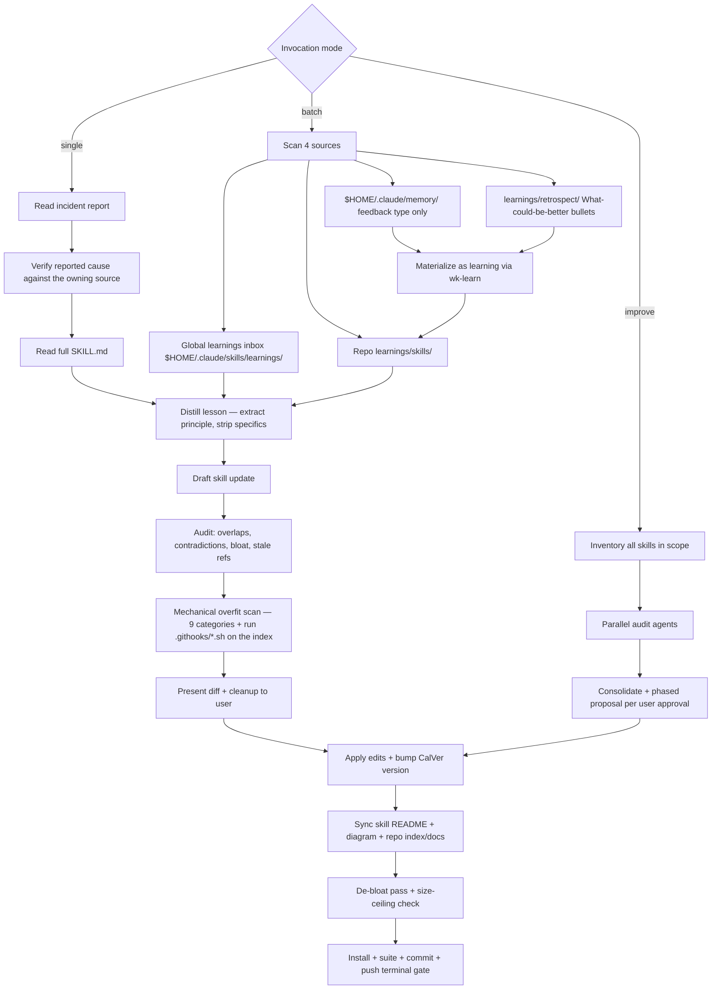

# wk-sharpen

> Distill field reports and prune skill bloat without overfitting on specific examples.

**Version:** `2026.07.28-024002`

## Invocation

| Mode | Trigger |
|------|---------|
| User-invocable | `/wk-sharpen <skill> [incident]`, `/wk-sharpen` (batch), `/wk-sharpen improve [scope]` |
| Model-invocable | automatic: after [`wk-retro`](../retro/README.md) surfaces skill gaps |

## How It Works

## Noteworthy

- **HARD RULE: [`wk-learn`](../learn/README.md) vs [`wk-sharpen`](../sharpen/README.md)** — [`wk-learn`](../learn/README.md) captures to `learnings/` only;
  [`wk-sharpen`](../sharpen/README.md) edits `SKILL.md`. Ambiguous phrasing ("learn from this") defaults to
  [`wk-learn`](../learn/README.md); only explicit "sharpen" or `/wk-sharpen` triggers SKILL.md edits.
- **The report is a hypothesis** — a learning's "Root cause" and "Suggested fix" are claims,
  not authority. When the subject is a deterministic artifact (hook, script, CI check), its
  source is read (and the failure reproduced where cheap) before drafting, and any fold that
  would *relax* a guard is rejected in favor of the underlying correctness bug. The run's own
  verification tooling is no more authoritative: a red result indicts the tooling before the
  artifact — a newly added case failing while every pre-existing case passes indicts the
  harness, and a failed positive control indicts the control. The artifact is driven directly
  with the same input, a canary is rebuilt as a literal the pattern actually matches, and a red
  result never licenses swapping the prescribed primitive.
- **A remedy must clear the target's installed rules before it is drafted** — a report's
  suggested fix can be mechanically correct and still un-foldable, because the reporter wrote it
  in whatever tooling the incident happened to involve. Before drafting, the prescribed remedy is
  checked against the HARD RULEs and tool-selection rules already installed in the target skill;
  where they conflict the installed rule wins, and the lesson is re-expressed in the sanctioned
  tooling keeping only what survives translation. Deferring this to the Step 5 audit is too late
  — once written, a new procedure contradicting an old HARD RULE reads as a second valid option
  rather than as a defect.
- **A disproof voids the draft** — verification is not a pass/delete filter on the reported
  mechanism. Once reproduction disproves *or sharpens* it, the fold is re-derived from the
  source's semantics rather than reworded, since a corrected mechanism usually changes what the
  rule should say and upgrades a heuristic remediation to a deterministic one. The formulation a
  later run can drive the source to demonstrate wins.
- **A recorded rejection is a case to execute, not prose to re-read** — when an audit surfaces a
  `Rejected` / `Deliberately not promoted` note covering the design about to be adopted, the
  shape it names is driven against the artifact before *and* after the change and the verdicts
  must match. A suite that stays green without ever covering that shape is evidence of missing
  coverage, not of safety, so the case lands as a pinned test in the same pass. An over-broad
  note is rewritten to what actually holds once a compensating rule makes the design safe.
- **Verifying a guard on the agent's own tool calls** — the faithful test input is itself a
  blocked call, so each payload is staged with the file-write tool and fed to the hook by
  redirect. The guard's opt-out is never used to run its own test.
- **Mechanical overfit scan** is mandatory before presenting any diff — 9 categories
  (reviewer logins, org prefixes, employer/internal project names, ticket IDs, repo names,
  line numbers, tool versions, person names, hardcoded branch names) are grepped against the
  proposed text.
- **Run the hooks, never reimplement their matcher** — a hook's pattern file carries `#`
  comments and PCRE inline flags that a hand-rolled `grep -iEf` turns into either false noise
  or a false-clean, so the scan executes `.githooks/*.sh` against the staged index. Two
  scans stay hand-rolled: staged **path strings** (every content hook greps the diff and
  commit message but never filenames) and the **overfit category** scan over drafted text.
- **The verdict protocol binds the construction, not the named scan.** A discipline written
  for one scan does not travel to a sibling of the same shape, even inside the same step —
  so *every* hand-rolled scan uses one quoted path per `grep` and branches its verdict on
  that scan's own rc. A printed "clean" banner is a decoration, never a verdict: a
  multi-path grep returns a single status for the whole set and a read failure **dominates
  a genuine match**, so rc≥2 can mask a hit that still printed.
- **Terminal gate** (Step 8) requires all five checks: install prints `Done!`, the owning
  skill's test suite runs when the fold touched a shipped executable artifact, commits land,
  single push, and no modified tracked path — untracked *unprocessed* learnings/retros are
  expected state, not debris. Silence after edits is a violation.
- **A signer outage blocks the commit gate and the push gate together.** Over an SSH remote
  the same ssh-agent backs commit signing and push authentication, so one refusal fails both
  Step 8 gates. `Permission denied (publickey)` right after a signing failure is that same
  outage wearing a different error string — probe once with `ssh -T git@<host>`, report both
  gates blocked under one root cause, and never attempt the push as a workaround.
- **Anti-thrash is not gate discharge.** On a resumed signer-blocked fold the rule against
  re-running install/scan forbids *looping*, not *verifying*: an inherited fold's gates count as
  unrun until the tree records otherwise, so the shipped-code suite and the owning hooks still
  run. The index stays partitioned exactly as the prior run left it — staging a second fold
  merely to hook-check it destroys that run's path-scoped commit separation.
- **Batch mode** mirrors the global learnings inbox (`$HOME/.claude/skills/learnings/`) into the
  repo tree before distilling, then drains the inbox by deleting originals after copy.
- **A re-scan arrival is not automatically this run's work.** An item whose mtime postdates
  the run's start is unowned, not assigned — peer sharpen agents share the tree and there is no
  lock, lease, or ownership marker to arbitrate a collision. Neither mtime nor commit recency
  can see a peer's *claim*: processed state is recorded by renaming the file, and `mv` preserves
  mtime while advancing only ctime, so the two signals agree because both are blind in the same
  direction — never as corroboration. The listing is therefore re-read immediately before each
  item is folded, and an item that has vanished since the opening listing proves a concurrent
  writer whatever the timestamps say. Such items are reported as
  unclaimed backlog for the dispatcher, and the terminal state reads "processed N, M unclaimed,
  K distilled-not-landed" rather than "drained". That third bucket holds a fold applied to the
  worktree but blocked from committing: the source learning stays unrenamed and is named in the
  report, so it is neither counted as processed nor re-queued as backlog for a later run to fold
  a second time. A dispatcher's own claim that no peer is mid-fold is treated
  as a hypothesis that loses to contradicting evidence from the tree.
- **Ownership resolves before thoroughness, and severity never grants it.** A `severity: high`
  MUST-FOLD sets how thoroughly an item this run *owns* gets folded — never whether it owns it,
  so severity cannot convert an unowned or concurrently-claimed arrival into an assigned one.
  A high-severity unclaimed item escalates to the dispatcher as priority backlog. An
  independently blocked commit gate defers by *target-path* state rather than by gate state: a
  path already carrying an uncommitted fold is extended under its single version bump, while a
  clean unclaimed path is deferred as blocked backlog — folding only where it adds no
  entanglement the path did not already carry.
- **A re-violation is scored against the *installed* skill, not the worktree.** A rule
  strengthened only in an uncommitted fold never steered the run that "violated" it, so the
  escalation ladder is spent only when installed and worktree text agree; a divergence is
  classified `already-covered (unshipped)` instead. That rule is scoped to escalation
  *evidence* only — the opposite question, "did this fold land?", is a landing check and reads
  the **worktree**, where an uncommitted fold lives by definition. Under divergence the two
  reads answer different questions, and substituting one for the other reports a landed fold
  as missing.
- **External memories become learnings first** — each `$HOME/.claude/memory/` feedback file is
  materialized as a version-controlled learning via [`wk-learn`](../learn/README.md) and distilled through the
  Source 2 path; the memory file itself is never renamed (only the materialized learning is).
- **Improve mode** requires explicit phased user approval even in auto mode — suite-scale
  refactoring is high blast-radius and can never be applied silently.
- **De-bloat pass** is mandatory on every run (not only when a learning prompts it) and
  enforces a hard 24 KiB ceiling per `SKILL.md` — over-ceiling skills are refactored, split into
  references/sub-skills, or scoped down, coverage-preserving. A pre-commit hook backstops the
  same ceiling. Only a ceiling blocks — the hook tests nothing else — so a net-non-positive
  fold is owed only once the headroom trigger fires (headroom under ~2× the edit); with the
  trigger silent no reclaim is owed and a positive net lands. Stated as a flat gate instead,
  the rule is unsatisfiable whenever the reclaim pool is empty, since the only routes to a
  non-positive net are a forbidden load-bearing cut or an abandoned fold.
  The byte budget for a near-ceiling fold is stated as explicit arithmetic —
  measured addition, each reclaim's measured net — before any edit is applied; estimating
  either side makes the mandated single pass a coin flip. Reclaim is searched in a fixed
  order — an inline rule whose own linked reference already states it in full is deleted
  outright first (full value, zero coverage risk), relocation is considered last, and a
  recorded stay-inline decision is honored rather than reopened under ceiling pressure.
  Duplicates are scored by reading order: only the *later* occurrence is deletable, because
  removing a rule's earliest statement moves it later and recreates the reachability defect
  the reading-order fixes exist to prevent. Relocation is exempt from that objection — it
  bites only when the surviving pointer sits later, so writing the pointer into the bullet
  the block was cut from leaves the rule reachable exactly where it was. A target rejected
  purely on reading order is therefore mis-tested rather than exhausted, and is re-tested
  under a cut-site pointer before the pool is declared empty. When that pool is exhausted and the net is still
  positive, the *addition* is the next target rather than the last resort — a draft's first
  size is an estimate, not a requirement, and it is the only lever that cannot endanger
  existing load-bearing content.
- **A fold that rewrites a gate governing its own landing is bound by the stricter of the
  pre-edit and post-edit text.** Every other fold's rules and its target are independent, so
  "apply the skill as written" has one referent; it has two only when the edit rewrites the
  rule deciding that edit's own admissibility. A loosened rule takes effect on the next run
  once installed — never on the run that writes it — which is the same installed-vs-worktree
  distinction the escalation gate already applies in the punitive direction. This is also the
  case where the permissive reading is most attractive and least checkable: a loosened rule's
  first beneficiary is the run that loosened it, and the commit looks fully compliant under
  its own new text. The run report records which reading was applied.
- **A unanimous verdict at any memory-scan stage indicts the tooling, not the files** — and the
  two stages fail in opposite directions, so neither guard generalizes to the other. All-reject
  at the parse gate under-reports as a false *empty*, which is the more dangerous half: it
  produces no visible work, so nothing prompts an investigation. All-un-distilled at the marker
  diff over-reports. A hand-rolled filter's zero closes out a source only after a positive
  control moves its count.
- **Non-unanimity never exonerates the gate.** A shape-partial matcher splits *by
  construction* — it classifies the shape it knows and drops the shape it does not — so the
  unanimity guard's sensitivity falls as the blind spot widens, and a mixed verdict is that
  blind spot's signature rather than evidence against one. The parse gate therefore matches
  `type:` at column 0 **and** nested under `metadata:` (both shapes occur in the store, and a
  matcher keyed on either alone silently drops real memories), and a positive control is built
  **per shape** — a lone control synthesized by the matcher's own author shares its shape
  assumption, so control and matcher agree while both are wrong.
- **A control only carries evidence if its target can structurally produce a hit under the
  scan's own invocation form** — the constraint now governs all four sources, not just the
  memory scan. Topical proximity is not structure: a traversal primitive that silently skips a
  class of node (`find -type f` never descends a symlinked directory) returns zero for any
  content when rooted where those nodes live, so the control is dead while reading exactly like
  a confirmed drain. Every drain is re-proved with an in-place canary re-run through the
  identical form, plus a primitive that does not share the scan's blind spot.
- **A two-stage-disagreement control must *reach* the deciding comparison, not merely permit
  it — and the right placement inverts with which stage is left unpinned.** Correct data shape
  and correct intent both leave the decision reachable-but-unreached. With the *comparison*
  unpinned and both inputs sorted alike, a merge consults ordering only where the streams
  differ, so the order-flipping element must be the differing one; a matched pair is consumed
  by the equality step and exercises nothing. With one input's *sort* unpinned the inverse
  holds: only an order-flipping **matched pair** is met at mismatched offsets and mis-emitted as
  a phantom, while a row unique to one side is emitted as unique by any walk, so its verdict
  cannot move. Liveness is the arms' *verdicts* diverging — never their sort orders differing,
  and never the bare fact that rows were produced. Placements are tabulated in
  [`references/memory-marker-diff.md`](references/memory-marker-diff.md).
- The gitignored `.distilled-memories` marker prevents re-distilling the same global memory
  across runs (`--force` bypasses it); learnings **and retrospects** track their own processed
  state via the `.learned.md` rename — no marker. Retros are write-once per-session files, so
  the rename can never orphan later content (a new session writes a new file).
