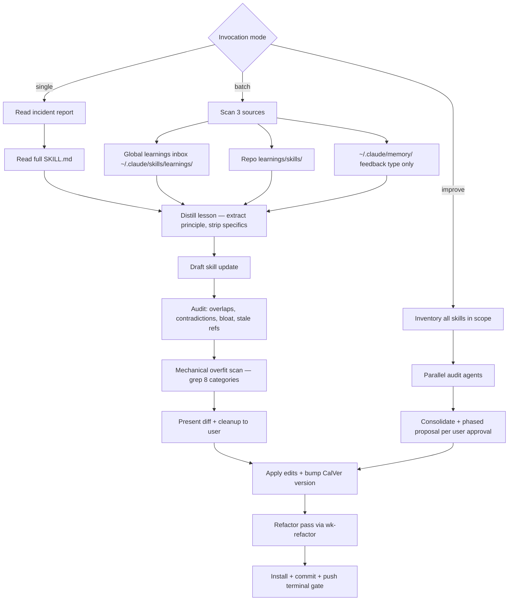

# wk-sharpen

> Improve a skill based on field reports or incident retrospectives without overfitting on specific examples.

## Invocation

| Mode | Trigger |
|------|---------|
| User-invocable | `/wk-sharpen <skill> [incident]`, `/wk-sharpen` (batch), `/wk-sharpen improve [scope]` |
| Model-invocable | automatic: after `wk-retro` surfaces skill gaps |

## How It Works

## Noteworthy

- **HARD RULE: `wk-learn` vs `wk-sharpen`** — `wk-learn` captures to `learnings/` only;
  `wk-sharpen` edits `SKILL.md`. Ambiguous phrasing ("learn from this") defaults to
  `wk-learn`; only explicit "sharpen" or `/wk-sharpen` triggers SKILL.md edits.
- **Mechanical overfit scan** is mandatory before presenting any diff — 8 categories
  (reviewer logins, org prefixes, ticket IDs, repo names, line numbers, tool versions,
  person names, hardcoded branch names) are grepped against the proposed text.
- **Terminal gate** (Step 8) requires all four checks: install prints `Done!`, commits land,
  single push, clean tree — silence after edits is a violation.
- **Batch mode** mirrors the global learnings inbox (`~/.claude/skills/learnings/`) into the
  repo tree before distilling, then drains the inbox by deleting originals after copy.
- **Improve mode** requires explicit phased user approval even in auto mode — suite-scale
  refactoring is high blast-radius and can never be applied silently.
- The `.distilled-sources.log` prevents re-processing memory files across runs; `--force`
  flag bypasses it for full rescans.
