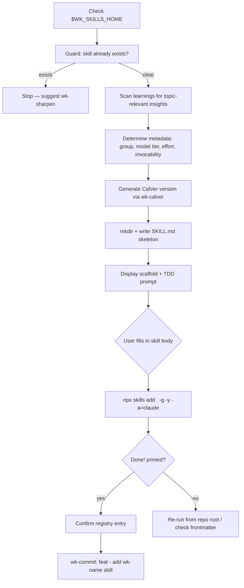

# wk-skill

> Scaffold a new wk-* skill from the canonical template with full infrastructure wiring.

## Invocation

| Mode | Trigger |
|------|---------|
| User-invocable | `/wk-skill <name>`, "create a skill", "new skill", "bootstrap a skill" |
| Model-invocable | automatic: when another skill needs a companion skill created |

## How It Works

## Noteworthy

- **HARD RULE: skeleton only** — the scaffold writes no behavior instructions. The body must
  be written only after the RED phase (test baseline agent behavior without the skill), per the
  `superpowers:writing-skills` TDD contract.
- The `wk-` prefix lives in the `name:` frontmatter field only — the **directory name** strips
  it (e.g., skill name `wk-foo` → directory `skills/foo/`).
- Step 3 surfaces unprocessed learnings relevant to the new skill's topic, which become the
  first draft of a `## Common Mistakes` section if matches are found.
- **Three model tiers** with specific model mappings: `sonnet` (most skills), `opus` (deep
  reasoning / adversarial), `haiku` (trivial transforms / calver generation).
- `$WK_SKILLS_HOME` must be set; the skill stops immediately if missing — it does not guess
  or fall back to `$PWD`.
- `## Post-Completion` section with `wk-learn <name>` call is always added to the skeleton —
  every skill is expected to capture its own learnings.
