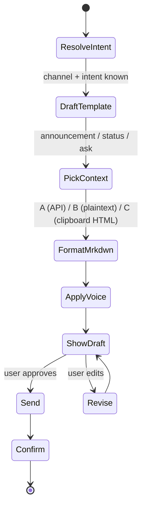

# wk-slack

> Compose and send Slack messages — announcements, PR review requests, status updates, standup snippets, and
> channel posts — in the user's established voice and correct Slack mrkdwn (never standard Markdown).

**Version:** `2026.06.15-200722`

## Invocation

| Mode | Trigger |
|------|---------|
| User-invocable | `/wk-slack` |
| Model-invocable | Automatic on: "post on Slack", "draft a Slack message", "announce a feature", "share a PR for review", "send a status update" |

## How It Works

## Noteworthy

- **Three formatting contexts, picked before writing:** Context A (Slack API / bot messages, `<url|label>`
  mrkdwn), Context B (plaintext compose box, bare URLs auto-linkify), Context C (copy-to-clipboard from a web
  dashboard via `ClipboardItem` `text/html`). Mixing them silently breaks links and structure.
- **HARD RULE — mrkdwn, never Markdown:** `*bold*` not `**bold**`; `<url|label>` not `[label](url)`; `~strike~`
  not `~~strike~~`. A conversion table maps every element.
- **Context C clipboard buttons need a fallback:** `ClipboardItem` (`text/html`) preserves clickable labels and
  nesting on paste; fall back to `navigator.clipboard.writeText(el.innerText)` when `ClipboardItem` is
  unavailable (older browsers, insecure context).
- **Canonical Standup Snippet spec:** One `<ul>` with Yesterday / Today / Blockers top-level `<li>`s; each leaf
  bullet carries at most one link; groups become a parent bullet plus one child per artifact. The day-marker
  emoji **leads** each heading (`👈🏽 Yesterday`, never trailing), and Blockers is always present with `✋🏽`
  (`None` when empty). Callers ([`wk-sitrep`](../sitrep/README.md)) invoke this
  section rather than re-implementing it.
- **Standup privacy filter (HARD RULE):** Hiring/candidate, HR/QPR/comp, and personal-communication items are
  dropped from the public standup even when they stay in the private dashboard. When uncertain, omit.
- **Voice rules derived from real posts:** topical heading emoji, conversational tl;dr, no signature block,
  never over-tag, closing CTA is an invitation not a demand.
- **HARD RULE — always show the draft before posting** unless the user asked for a fire-and-forget send; Slack
  messages are hard to retract.
