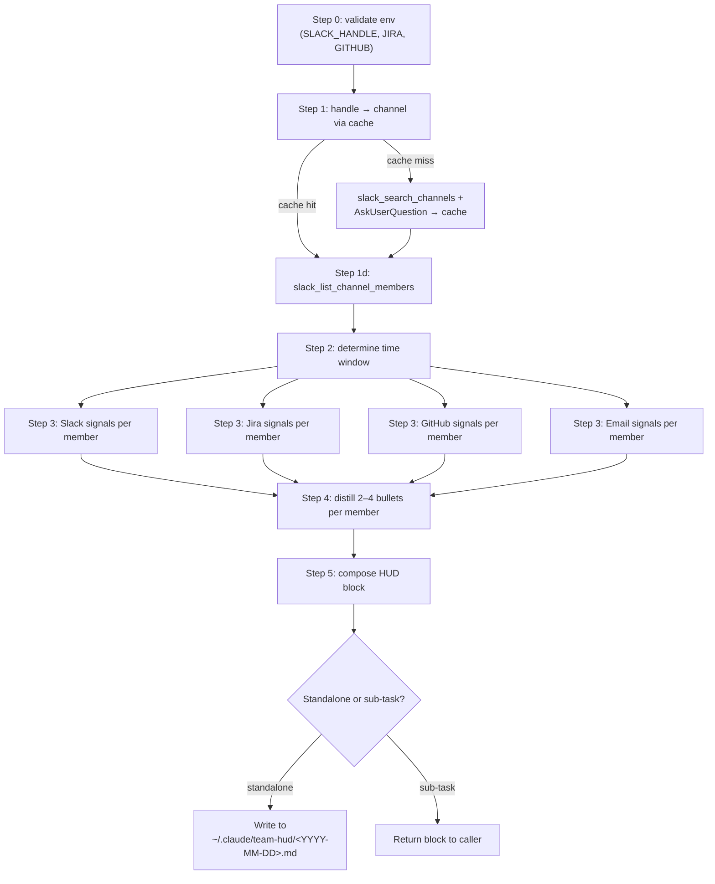

# wk-team-hud

> **⚠️ Work in progress — `model-invocable: false`, `user-invocable: false`.**
> Three roster sources are blocked. See [Blockers](#blockers) below before
> attempting to enable.

> Generate a heads-up display of what each team member is working on —
> surfacing PRs, Jira tickets, Slack activity, announcements, shareouts,
> and emails. Designed to be invoked in parallel by
> [`wk-sitrep`](../sitrep/README.md) to produce the team-activity section of daily summaries.

## Invocation

| Mode | Trigger |
|------|---------|
| User-invocable | `/wk-team-hud` (currently disabled, status: wip) |
| Model-invocable | parallel sub-task from [`wk-sitrep`](../sitrep/README.md) (currently disabled) |

## Configuration

Three env vars must be set before this skill runs:

| Variable | Purpose |
|----------|---------|
| `WK_SKILLS_TEAM_SLACK_HANDLE` | Comma-separated Slack usergroup handles (e.g., `your-team`). Resolved to channels via a one-time cache at `$WK_SKILLS_HOME/config/team-hud.yaml`. |
| `WK_SKILLS_TEAM_JIRA` | Comma-separated Jira project keys (e.g., `ENG,DATA`). |
| `WK_SKILLS_TEAM_GITHUB` | GitHub org or `org/repo` filter. URL form `https://github.com/orgs/<org>/teams/<slug>` is also accepted; the URL is parsed into `<org>` + `<slug>` and members are fetched via `gh api orgs/<org>/teams/<slug>/members`. |

## How It Works

## Blockers

End-to-end first-run probing surfaced three issues that keep this skill
disabled:

- **Slack `missing_scopes`.** `slack_list_channel_members` fails on both
  private and public channels because the MCP token lacks
  `channels:read.members` / `groups:read.members`. Resolution: re-auth
  the Slack MCP with both scopes, or pivot the contract to an explicit
  member CSV env var.
- **Jira Atlassian Team URL has no MCP endpoint.** The Atlassian Teams
  REST API exists (`api.atlassian.com/public/teams/v1/teams/<id>/members`
  returned `401`, not `404`), but the Jira MCP server does not expose
  it. Resolution: same cache pattern as Slack — prompt once for a CSV
  of accountIds and persist to `$WK_SKILLS_HOME/config/team-hud.yaml`.
- **Google Group has no MCP at all.** Neither the Gmail nor any Google
  MCP exposes the Workspace Admin SDK / Cloud Identity Groups API, and
  `gcloud identity groups` is not installed locally. Resolution: drop
  the env var and let the Slack roster carry, or prompt for a manual
  member-email CSV.

## Noteworthy

- **Cache lives at `$WK_SKILLS_HOME/config/team-hud.yaml`** and is
  gitignored — handle→channel mappings are repo-local, never auto-picked
  (a wrong cache entry silently poisons every future run).
- **HARD RULE: pull from live sources.** Carry-over items from prior
  briefs are never re-surfaced without cross-checking against this run's
  fetched data — see the equivalent rule in
  [`wk-sitrep`](../sitrep/README.md).
- **Excludes the calling user.** This is a *team* brief; the caller's
  own activity is surfaced by the parent skill in other sections.
- **GitHub team URL parsing** uses `gh api orgs/<org>/teams/<slug>/members`,
  which works against the authenticated `gh` CLI without needing a
  separate MCP endpoint.
- Re-enabling: flip `model-invocable` / `user-invocable` to `true` in
  `SKILL.md`, drop the WIP banner, and bump the CalVer version after
  any one of the three blockers above has a working path.
