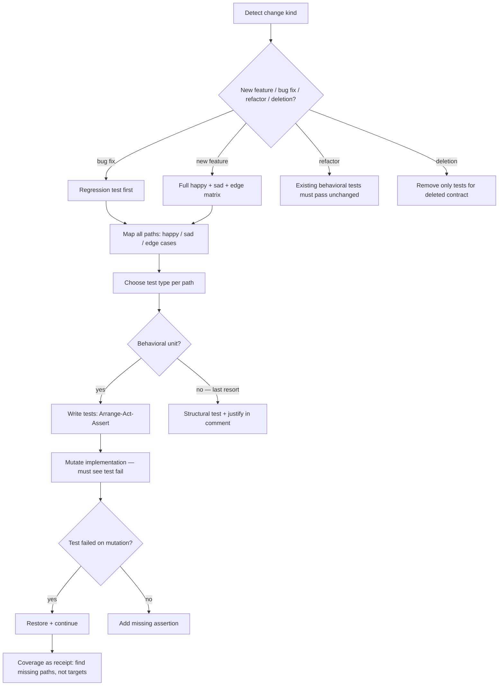

# wk-testing-skeleton

> Frames how the agent writes tests — biases toward behavioral coverage, requires mutation verification.

**Version:** `2026.08.05-192717`

## Invocation

| Mode | Trigger |
|------|---------|
| User-invocable | not directly invocable |
| Model-invocable | automatic: whenever the agent is about to write, add, or modify tests |

## How It Works

## Noteworthy

- **Structural tests are a last resort**, not a default. Any structural test must include a
  comment naming why behavioral observation was unavailable: `# structural: ...`.
- **Mutation verification is required for every new behavioral test** — two exemptions only:
  property-based tests (fuzzer does it) and snapshot tests (diff is the verification).
- The **behavioral/structural dividing line** test: "if I rewrote this function from scratch
  keeping its contract, would the test still pass?" — yes = behavioral, no = structural.
- **Format validators** must be derived from real example values found in the codebase or
  upstream docs, not from intuition — intuition-based validators routinely reject legal inputs.
- **Boundary fakes must enforce external API contracts.** Pair prerequisite configuration or
  permission assertions with adapter tests that reject unsupported arguments and reproduce the
  documented return and async-completion shape.
- [`wk-testing-skeleton`](../testing-skeleton/README.md) produces the plan; [`wk-workflow`](../workflow/README.md) Phase 3 verifies the suite passes —
  they are complementary, not redundant.
- **An ad-hoc probe against the test database is a state mutation.** Framework runners commit
  by default, so a throwaway verification script leaves rows the suite never created — wrap the
  probe in an always-rollback transaction or re-prepare the database before the next run, and
  read an unexplained failure in an untouched spec as self-inflicted pollution first.
- **`activeTab` requires a real browser gesture.** Trigger the extension's
  browser action or command before gated assertions; direct popup navigation
  does not grant the permission.
- **Agent-facing export fixtures must be actionable.** Include a realistic
  problem and desired outcome, then prove the downstream consumer can act—not
  merely that the archive and fields persist.
- Coverage % is explicitly treated as a lagging indicator — CI coverage gate failures must be
  solved by finding the missing behavioral path, never by adding structural tests to touch lines.
