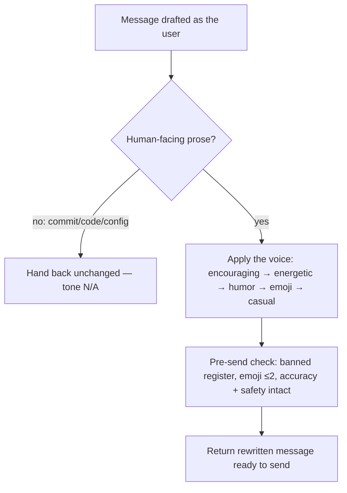

# wk-tone

> Apply the user's personal voice — encouraging, energetic, humorous, with
> purposeful emoji — to any message drafted on their behalf.

**Version:** `2026.07.28-171112`

## Invocation

| Mode | Trigger |
|------|---------|
| User-invocable | `/wk-tone "<draft>"` or `/wk-tone` to rewrite the in-context draft |
| Model-invocable | Automatic before posting a message **as the user** to Slack, Jira, GitHub/PR comments, email, or any human-facing channel |

## How It Works

## The Voice

Five load-bearing traits, in priority order:

1. **Encouraging & collaborative** — soften asks, assume good intent, affirm the reader when flagging issues.
2. **Energetic & decisive** — short, punchy, next-action-forward; no hedge stacks.
3. **Humorous** — dry wit and self-aware tech jokes, aimed at the situation never the person.
4. **Emoji as intent** — one or two per message, each carrying meaning; Slack shortcodes in chat, Unicode elsewhere.
5. **Casual register** — lowercase-first chat shorthand, parenthetical asides, evidence linked inline.

## Noteworthy

- **Scope guard** — only rewrites human-facing prose. Commit messages, code, and config are classified out in Step 1 and left to their own conventions (e.g. [wk-commit](../commit/README.md)).
- **Safety is never tone-washed** — a security or irreversible-action warning keeps its weight; tone is the wrapper, not the content.
- **Emoji ≤ 2, intent-only** — emoji spam and forced humor are the two failure modes the skill explicitly guards against.
- **Channel-aware register** — chat leans casual; Jira/GitHub/email keep the warmth and wit in full sentences.
- Discovered from the user's real Slack and Jira message history, then distilled into the five traits above.

## Requirements

- A draft message or in-context message to rewrite
- Knowledge of the target channel to pick emoji style

---

## Post-Completion

Invoke [wk-learn](../learn/README.md) with this skill's short name as the argument (e.g., `wk-learn tone`).
