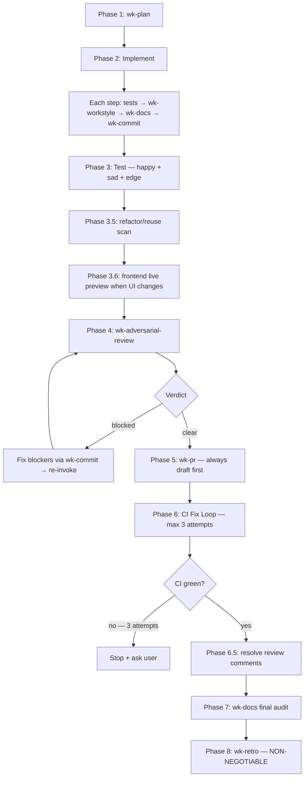

# wk-workflow

> Master workflow for all development tasks — orchestrates every wk-* skill in prescribed order.

**Version:** `2026.07.21-210806`

## Invocation

| Mode | Trigger |
|------|---------|
| User-invocable | not directly invocable |
| Model-invocable | automatic: fires on every task that will produce code changes, a commit, or a PR |

## How It Works

## Noteworthy

- **No opt-out, no size exemption** — "this is small" and "just a quick fix" are explicitly
  named red flags. If a diff will be produced, the full workflow applies.
- **Skill invocation is mandatory** via the `Skill` tool — approximating skill behavior with
  raw commands skips guards and conventions that the skills contain.
- **Progressive disclosure:** the skill is debloated under 500 lines. Phase 1 delegates to
  [`wk-plan`](../plan/README.md), and later phases invoke focused skills instead of inlining their full
  rule sets.
- **Phase 1 delegates to [`wk-plan`](../plan/README.md)** — all planning gates and probes live there:
  Jira pre-flight, user-provided artifact first, prefactor probe, intra-file duplication probe,
  spec pre-flight, new-capability probe, rule-set doc sync probe, tool-swap flag-parity probe,
  and producer-audit probe.
- **Design pivots travel with their docs** — a commit changing logical structure must update
  spec, plan, inline comments, test names, and any ADR in the same commit. No deferred rewrites.
- **One review gate** — [`wk-adversarial-review`](../adversarial-review/README.md) runs once, at Phase 4. It is not
  re-run per phase or per push; the gate is keyed to new commits since the last clear verdict, so later pushes
  (CI fixes, rework) re-fire it only on the delta and otherwise reuse the prior clearance.
- **CI fix loop** has a 3-attempt limit with an axis-of-variation check: attempts 1 and 2 on
  the same axis require broadening to a different axis on attempt 3, not "the same thing harder."
- **Phase 8 ([`wk-retro`](../retro/README.md)) is non-negotiable** — mandatory regardless of task outcome, even if
  the session was short or nothing interesting happened.
