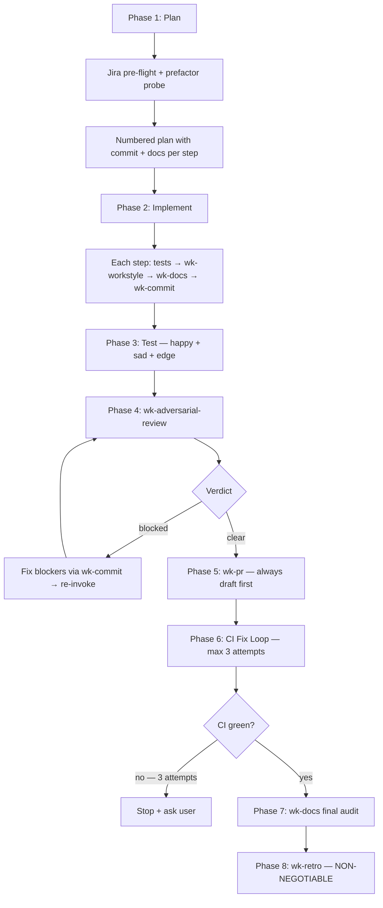

# wk-workflow

> Master workflow for all development tasks — orchestrates every wk-* skill in prescribed order.

**Version:** `2026.06.12-122600`

## Invocation

| Mode | Trigger |
|------|---------|
| User-invocable | not directly invocable |
| Model-invocable | automatic: fires on every task that will produce code changes, a commit, or a PR |

## How It Works

## Noteworthy

- **No opt-out, no size exemption** — "this is small" and "just a quick fix" are explicitly
  named red flags. If a diff will be produced, the full workflow applies.
- **Skill invocation is mandatory** via the `Skill` tool — approximating skill behavior with
  raw commands skips guards and conventions that the skills contain.
- **Prefactor probe** fires when new work resembles existing patterns ("another X", "similar
  to X") — lift shared logic first, migrate existing caller second, extend third.
- **Design pivots travel with their docs** — a commit changing logical structure must update
  spec, plan, inline comments, test names, and any ADR in the same commit. No deferred rewrites.
- **CI fix loop** has a 3-attempt limit with an axis-of-variation check: attempts 1 and 2 on
  the same axis require broadening to a different axis on attempt 3, not "the same thing harder."
- **Phase 8 ([`wk-retro`](../retro/README.md)) is non-negotiable** — mandatory regardless of task outcome, even if
  the session was short or nothing interesting happened.
