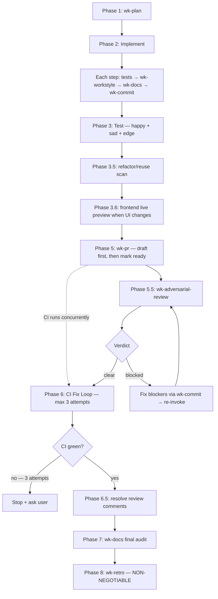

# wk-workflow

> Master workflow for all development tasks — orchestrates every wk-* skill in prescribed order.

**Version:** `2026.08.20-204907`

## Invocation

| Mode | Trigger |
|------|---------|
| User-invocable | not directly invocable |
| Model-invocable | automatic: fires on every task that will produce code changes, a commit, or a PR |

## How It Works

## Noteworthy

- **Live learning capture is a Mandatory Activation rule** — invoke
  [`wk-learn`](../learn/README.md) immediately on a correction, scope redirect,
  or self-caught error, before continuing; also invoke it after every skill run.
  Phase 8 only audits that capture.
- **No opt-out, no size exemption** — "this is small" and "just a quick fix" are explicitly
  named red flags. If a diff will be produced, the full workflow applies.
- **Format skills run before their first matching edit:** Phase 2 enumerates
  planned file types and invokes [`wk-markdown`](../markdown/README.md),
  [`wk-mermaid`](../mermaid/README.md), or another applicable format owner before
  patching that content; arch-bearing paths run the
  [`wk-arch-review`](../arch-review/README.md) detector and retain its
  draft-complete authoring gate.
- **Skill invocation is mandatory** via the `Skill` tool — approximating skill behavior with
  raw commands skips guards and conventions that the skills contain.
- **Re-check command-level triggers before a CLI's first use.** Task-level
  selection is not enough when a later command activates a subsystem skill.
- **Mandatory PR lifecycle authorizes first publication.** Push the tracked task
  branch and create its PR; ask only where the governing workflow leaves
  publishing optional.
- **Progressive disclosure:** the skill is debloated under 500 lines. Phase 1 delegates to
  [`wk-plan`](../plan/README.md), and later phases invoke focused skills instead of inlining their full
  rule sets.
- **Phase 1 delegates to [`wk-plan`](../plan/README.md)** — all planning gates and probes live there:
  Jira pre-flight, user-provided artifact first, prefactor probe, intra-file duplication probe,
  spec pre-flight, new-capability probe, rule-set doc sync probe, tool-swap flag-parity probe,
  and producer-audit probe. A plan the user supplies — or one produced earlier this session —
  is never re-planned: it is validated for stale references, then executed from Phase 2.
- **Optional cross-repository scope is explicit:** confirm before inspecting or changing a sibling repository, and
  prefer its runnable devcontainer before proposing task-specific host installs.
- **The current dedicated task branch is authoritative:** do not propose
  another branch unless the checkout is default, detached, carries unrelated
  dirty work, or the user asks for additional isolation.
- **Artifact sync with code changes** — a commit changing logical structure must update spec,
  plan, inline comments, test names, and any ADR in the same commit (mechanics in
  [`references/doc-sync-mechanics.md`](references/doc-sync-mechanics.md)). No deferred rewrites.
- **One review gate, anchored to merge — Phase 5.5 is its only dispatch point.**
  [`wk-adversarial-review`](../adversarial-review/README.md) runs after publish
  and ready, so CI runs concurrently. Clearance follows reviewed work:
  finding-response commits and tree-identical rewrites preserve it; unmatched
  scope, refactor, or logic gets one delta-scoped review.
- **CI fix loop** has a 3-attempt limit with an axis-of-variation check: attempts 1 and 2 on
  the same axis require broadening to a different axis on attempt 3, not "the same thing harder."
- **Post-push verification adds evidence:** poll CI for the pushed SHA; do not
  repeat a local gate that already passed for that exact commit.
- **Dependent verification fails fast:** run expected-red proofs separately
  from later green gates, or start a grouped shell command with
  `set -euo pipefail`.
- **Execution environment is selected before validation:** inspect tracked container and runner configuration, use a
  runnable documented project container, and surface its absence before falling back to the host.
- **Mixed-toolchain boundaries are explicit:** name the subsystem owning a secondary-toolchain command before its
  first invocation, then still run the repository-wide primary gate.
- **Recursive repository searches are bounded before execution:** prefer tracked-content search; otherwise exclude
  dependency, distribution, coverage, cache, and generated-output directories.
- **User-loadable artifacts are built last:** enumerate required gates that write the handoff directory, run those
  gates first, then build and validate the deliverable as the final artifact-producing command.
- **Platform-pinned visual baselines come from CI:** inspect actual, expected, and diff images, then replace only the
  snapshots whose artifact confirms the intended visible change.
- **Default-branch-only producer acceptance:** reproduce the pinned producer in an isolated repository or controlled
  live canary before merge, feed exact artifacts and mutable metadata through every downstream required check, and
  keep completion blocked until the first live output passes its own required CI.
- **Phase 8 ([`wk-retro`](../retro/README.md)) is non-negotiable** — mandatory regardless of task outcome, even if
  the session was short or nothing interesting happened.
