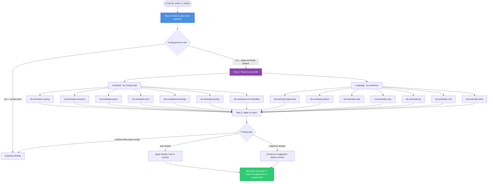

# wk-workstyle

> Code-quality orchestrator for every file the agent writes or edits — runs the style-authority probe, then routes to the `wk-workstyle-*` sub-skills (naming, structure, async, docs, testing, error-handling, per-language). Project linter wins.

## Invocation

| Mode | Trigger |
|------|---------|
| Model-invocable | Automatic before any [`wk-commit`](../commit/README.md) on a code-change diff; auto-invoked by [`wk-adversarial-review`](../adversarial-review/README.md) Step 2 |
| User-invocable | `/wk-workstyle scan` — full repo scan; `/wk-workstyle check <path>` — single file |

## Architecture

[`wk-workstyle`](../workstyle/README.md) is a **thin orchestrator**. It detects the project's style
authority once (Step 0), then dispatches to the `wk-workstyle-*` sub-skills that
carry the actual rule sets. Each sub-skill is **also independently
model-invocable** on adjacent work — editing a `.py` file fires
[`wk-workstyle-python`](../workstyle-python/README.md), writing an async block fires [`wk-workstyle-async`](../workstyle-async/README.md) — so
the rules apply continuously while coding, not only in the pre-commit sweep.

## Sub-skills

| Sub-skill | Fires when the agent… |
|---|---|
| [`wk-workstyle-naming`](../workstyle-naming/README.md) | introduces or renames an identifier |
| [`wk-workstyle-structure`](../workstyle-structure/README.md) | writes function bodies, control flow, imports, layout |
| [`wk-workstyle-async`](../workstyle-async/README.md) | touches async/concurrent code |
| [`wk-workstyle-docs`](../workstyle-docs/README.md) | adds/edits inline comments or updates existing docs |
| [`wk-workstyle-docstrings`](../workstyle-docstrings/README.md) | adds/edits structured docstrings or public callable signatures |
| [`wk-workstyle-testing`](../workstyle-testing/README.md) | writes or modifies tests |
| [`wk-workstyle-error-handling`](../workstyle-error-handling/README.md) | touches an error path |
| [`wk-workstyle-typescript`](../workstyle-typescript/README.md) | edits `.ts/.tsx/.js/.jsx/.mjs/.cjs` |
| [`wk-workstyle-python`](../workstyle-python/README.md) | edits `.py` |
| [`wk-workstyle-ruby`](../workstyle-ruby/README.md) | edits `.rb` or a Ruby bin script |
| [`wk-workstyle-rails`](../workstyle-rails/README.md) | a `bundle exec`/`bin/*`/`rails` command fails with a gem or env error |
| [`wk-workstyle-go`](../workstyle-go/README.md) | edits `.go` |
| [`wk-workstyle-rust`](../workstyle-rust/README.md) | edits `.rs` |
| [`wk-workstyle-shell`](../workstyle-shell/README.md) | edits `.sh` or a shell bin script |

## Noteworthy

- **Project config is always authoritative.** `.editorconfig`, `.eslintrc`, `.rubocop.yml`, `pyproject.toml`, etc. win on any conflict. Workstyle defaults fill gaps — they never fight the linter.
- **Step 0 is the single source of truth.** Sub-skills defer to the project-style-authority probe run here rather than re-running it.
- **Two classes of findings:** auto-fixable (rename, wrap line, add constant, sort imports, add doc stub) are applied silently; judgment-required (restructure logic, add test, extract function) are surfaced as suggestions before the commit lands.
- **Coverage reminder is non-skippable** (enforced by [`wk-workstyle-testing`](../workstyle-testing/README.md)); **stale comment removal is mandatory** (enforced by [`wk-workstyle-docs`](../workstyle-docs/README.md)).
- **Complements [`wk-format`](../format/README.md)** — [`wk-format`](../format/README.md) handles whitespace and lint-tool formatting; the [`wk-workstyle`](../workstyle/README.md) family handles naming, patterns, documentation, and structural quality. Both fire before commit.
