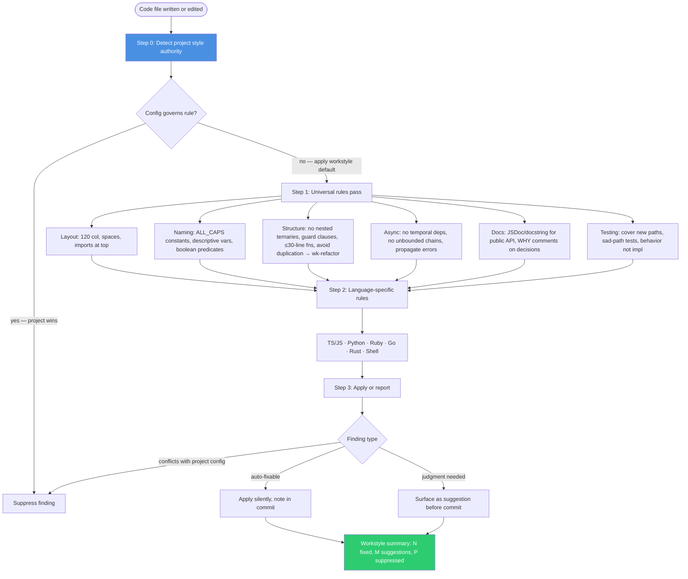

# wk-workstyle

> Code-quality gate applied to every file the agent writes or edits — naming, documentation, structure, constants, async patterns, and testing intent. Project settings always win; this skill fills gaps only.

## Invocation

| Mode | Trigger |
|------|---------|
| Model-invocable | Automatic before any `wk-commit` on a code-change diff; auto-invoked by `wk-adversarial-review` Step 2 |
| User-invocable | `/wk-workstyle scan` — full repo scan; `/wk-workstyle check <path>` — single file |

## How It Works

## Noteworthy

- **Project config is always authoritative.** `.editorconfig`, `.eslintrc`, `.rubocop.yml`, `pyproject.toml`, etc. win on any conflict. Workstyle defaults fill gaps — they never fight the linter.
- **Two classes of findings:** auto-fixable (rename, wrap line, add constant, sort imports, add doc stub) are applied silently; judgment-required (restructure logic, add test, extract function) are surfaced as suggestions before the commit lands.
- **Coverage reminder is non-skippable** — every non-trivial code addition without a corresponding test path is flagged. Exceptions: one-off scripts, migration runners, CLI scaffolding.
- **Stale comment removal is mandatory** — when editing code, update or delete adjacent comments that no longer accurately describe the code. Stale comments are worse than no comment.
- **Complements `wk-format`** — `wk-format` handles whitespace and lint-tool formatting; `wk-workstyle` handles naming, patterns, documentation, and structural quality. Both fire before commit.
- **Language-specific rule sets** cover TypeScript/JavaScript, Python, Ruby, Go, Rust, and Shell — each with idioms like `const`/no-`var`, f-strings, `set -euo pipefail`, no `.unwrap()` in Rust production paths, etc.
