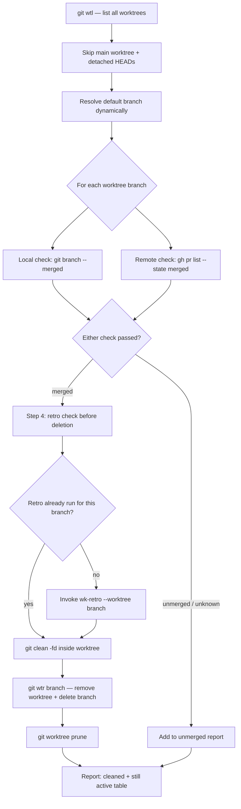

# wk-worktree-cleanup

> Clean up git worktrees whose branches have been merged.

## Invocation

| Mode | Trigger |
|------|---------|
| User-invocable | `/wk-worktree-cleanup`, "clean up worktrees", "prune stale worktrees" |
| Model-invocable | automatic: after a PR is merged, when `wk-workflow` suggests cleanup |

## How It Works

## Noteworthy

- **HARD RULE: run `wk-retro` before `git wtr`** — worktrees may hold the only copy of
  session notes or draft plans. Once removed, that context is unrecoverable.
- **`wk-retro` vs `wk-learn` are not interchangeable here** — retro writes to global memory
  (`~/.claude/memory/`); `wk-learn` writes skill-specific learnings. This step uses retro.
- **`git wtr` uses `-D` (force-delete)** regardless of merge status — never call it on an
  unconfirmed branch. When in doubt, classify as unmerged and let the user decide.
- A branch is considered merged if **either** check passes (local `git branch --merged` OR
  GitHub PR state), not both — squash merges and rebases don't show in local --merged.
- **Disposable untracked content** (temp dirs, OS metadata, gitignore'd files) is cleaned
  with `git clean -fd` without per-worktree confirmation — the classifier is the gate, not
  `--force` on `git worktree remove`.
- Default branch is resolved dynamically via `gh pr view` then `git symbolic-ref` — never
  hardcoded to `main` or `master`.
